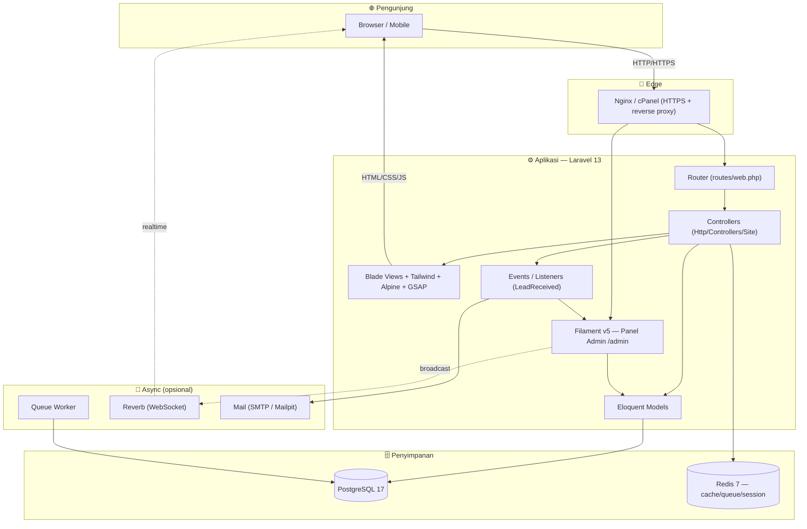
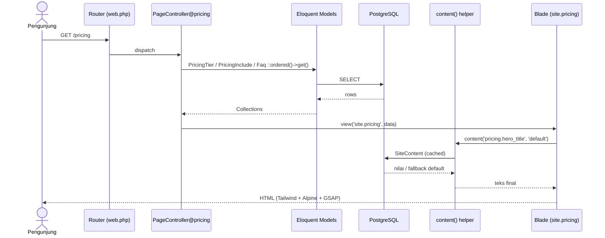
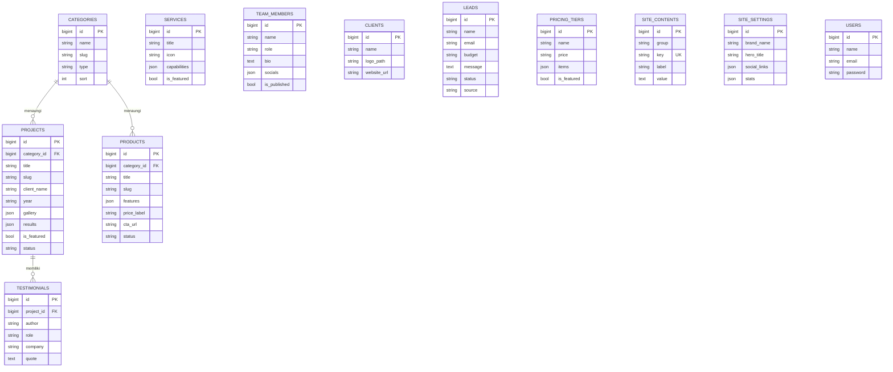
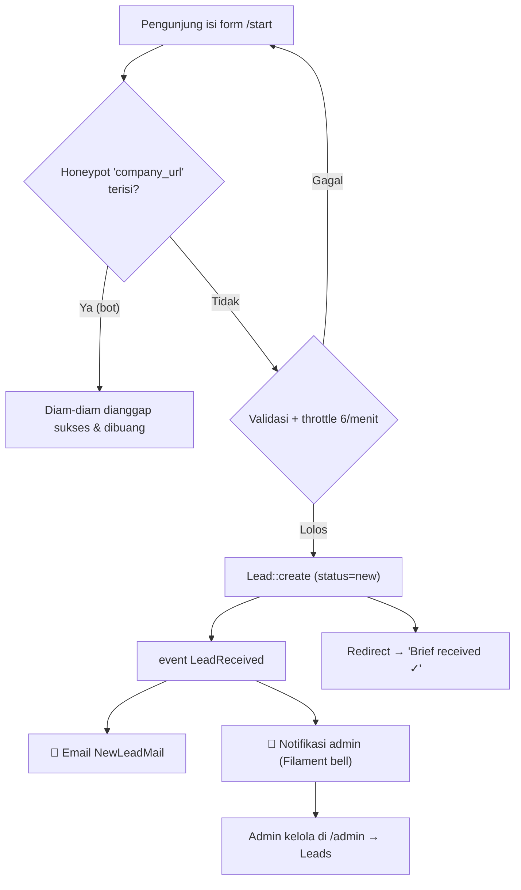
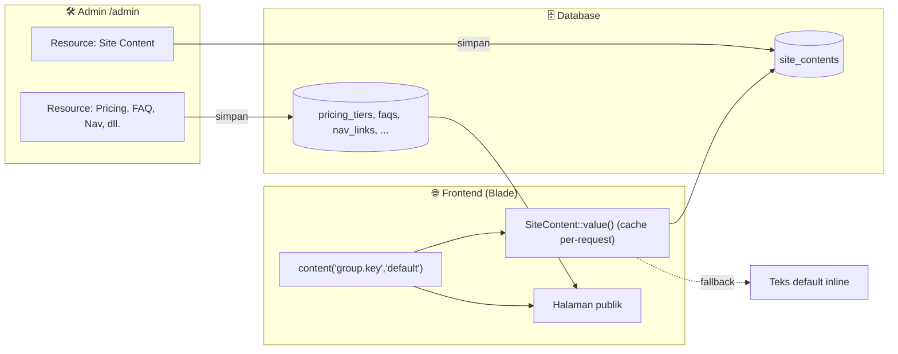
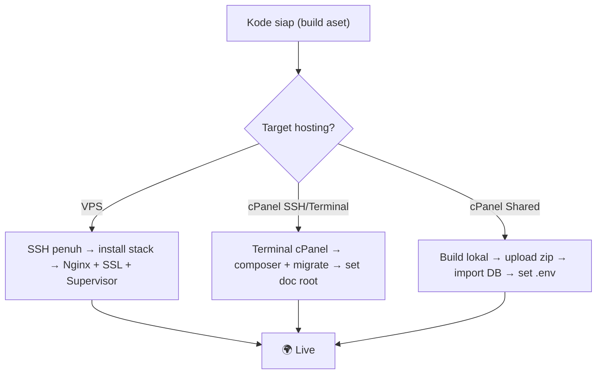

<div align="center">

# 🌳 Creative Trees Group

### Digital Product Studio & IT Ecosystem — Company Profile + CMS

Website company-profile profesional dengan estetika **monochrome • monospace • motion-driven**, ditenagai **Laravel 13 + Filament v5**, dengan **CMS penuh** sehingga *seluruh* konten frontend dapat dikelola tanpa menyentuh kode.

<!-- Badges -->


</div>

---

## 📑 Daftar Isi

1. [Tentang Proyek](#-tentang-proyek)
2. [Tujuan](#-tujuan)
3. [Fitur Utama](#-fitur-utama)
4. [Tech Stack](#-tech-stack)
5. [Arsitektur Sistem](#-arsitektur-sistem)
6. [Alur Request (Request Flow)](#-alur-request-request-flow)
7. [Skema Database (ERD)](#-skema-database-erd)
8. [Alur Lead / Kontak](#-alur-lead--kontak)
9. [Alur CMS (Editable Content)](#-alur-cms-editable-content)
10. [Struktur Folder](#-struktur-folder)
11. [Instalasi Lokal](#-instalasi-lokal)
12. [Deployment ke Produksi](#-deployment-ke-produksi)
    - [A. VPS (Ubuntu)](#a--deploy-ke-vps-ubuntu-2224)
    - [B. cPanel Shared (tanpa Terminal)](#b--deploy-ke-cpanel-shared-tanpa-terminal)
    - [C. cPanel dengan Terminal / SSH](#c--deploy-ke-cpanel-dengan-terminal--ssh)
13. [Konfigurasi `.env`](#-konfigurasi-env)
14. [Panduan CMS / Admin](#-panduan-cms--admin)
15. [Perintah Berguna](#-perintah-berguna)
16. [Testing](#-testing)
17. [Keamanan](#-keamanan)
18. [Kontribusi](#-kontribusi)
19. [Lisensi](#-lisensi)

---

## 🌟 Tentang Proyek

**Creative Trees Group** adalah platform *company profile* untuk sebuah studio produk digital & ekosistem IT. Dibangun untuk kebutuhan **startup & organisasi**, ia menggabungkan:

- **Frontend publik** yang elegan (hero animatif, katalog layanan, portofolio, pricing, proses kerja, tim, FAQ, form lead) — semua *mobile-first* dengan animasi halus (GSAP + Lenis + Alpine).
- **Panel admin (CMS)** berbasis **Filament v5** dengan **17 resource** — *setiap* teks, kartu, harga, FAQ, menu navigasi, hingga copy hero **dapat diubah tanpa coding**.
- **Arsitektur cPanel-safe**: default berjalan tanpa WebSocket (opsional real-time via Reverb), sehingga mudah di-deploy di shared hosting maupun VPS.

> Filosofi desain: *monochrome* (hitam/putih), *monospace* (JetBrains Mono), brutalis-minimal, dengan gerak yang terasa premium namun menghormati `prefers-reduced-motion`.

---

## 🎯 Tujuan

| # | Tujuan | Bagaimana dicapai |
|---|---|---|
| 1 | **Citra profesional & modern** untuk menarik klien | Desain konsisten, animasi premium, performa cepat |
| 2 | **Mudah dikelola non-teknis** | CMS lengkap (CRUD semua konten) lewat Filament |
| 3 | **Mengubah pengunjung → lead** | Form *Start a project* + Contact dengan validasi, anti-spam, & notifikasi |
| 4 | **Mudah di-deploy & dirawat** | Docker untuk dev; kompatibel VPS & cPanel; tanpa ketergantungan WebSocket wajib |
| 5 | **Aman & accessible** | Security headers, honeypot + throttle, kontras AA, semantik a11y |

---

## ✨ Fitur Utama

- 🎨 **Frontend dinamis** — Home, Services, Work (+case study), Pricing (carousel + FAQ accordion), Process, Team, Products, About, Contact, Start (lead form).
- 🛠️ **CMS 17 resource** — Services, Products, Projects, Team, Clients, Testimonials, Pricing Tiers, Pricing Includes, Process Phases, Principles, FAQ, Start Steps, Nav Links, Categories, Leads, Site Settings, **Site Content** (semua copy statis).
- 📨 **Lead pipeline** — validasi, honeypot, rate-limit, event → email + notifikasi admin.
- ⚡ **Motion system** — reveal blur-in, text-scramble, magnetic buttons, canvas char-field, custom cursor, count-up, carousel (Swiper), smooth-scroll (Lenis).
- 🔒 **Hardening** — security headers, CSRF, `.env` aman, akses admin di-gate per domain email.
- 🐳 **Docker stack** — PostgreSQL, Redis, Reverb, Queue, Vite, Mailpit.
- 📈 **SEO** — sitemap.xml, robots.txt, meta OG/canonical dinamis.

---

## 🧱 Tech Stack

| Lapisan | Teknologi |
|---|---|
| **Bahasa** | PHP **8.3+** |
| **Framework** | Laravel **13** |
| **Admin / CMS** | Filament **5** (Livewire) |
| **Frontend** | Blade · Tailwind CSS **4** · Alpine.js · GSAP + ScrollTrigger · Lenis · Swiper |
| **Database** | **PostgreSQL 17** |
| **Cache / Queue / Session** | **Redis 7** |
| **Real-time (opsional)** | Laravel **Reverb** + Laravel Echo + pusher-js |
| **Build** | Vite **8** |
| **Dev infra** | Docker Compose (nginx · postgres · redis · reverb · queue · vite · mailpit) |
| **Tooling** | Pint · PHPUnit/Pest · Pail · Faker |

---

## 🏗️ Arsitektur Sistem



---

## 🔄 Alur Request (Request Flow)

Contoh: pengunjung membuka halaman **Pricing**.



---

## 🗃️ Skema Database (ERD)

> Relasi inti: **Category** menaungi **Project** & **Product**; **Project** memiliki banyak **Testimonial**. Sisanya adalah konten mandiri yang dikelola via CMS.



**Model & relasi (Eloquent):**

| Model | Relasi | Catatan |
|---|---|---|
| `Category` | `hasMany(Project)`, `hasMany(Product)` | taksonomi |
| `Project` | `belongsTo(Category)`, `hasMany(Testimonial)` | portofolio / case study |
| `Product` | `belongsTo(Category)` | katalog produk |
| `Testimonial` | `belongsTo(Project)` | quote klien |
| `Service`,`TeamMember`,`Client`,`Lead`, `PricingTier`,`PricingInclude`,`ProcessPhase`, `Principle`,`Faq`,`StartStep`,`NavLink`, `SiteContent`,`SiteSetting`,`User` | — | mandiri / singleton |

---

## 📨 Alur Lead / Kontak



---

## 🧩 Alur CMS (Editable Content)

Semua copy statis memakai helper global `content('key', 'default')` — mengambil nilai dari DB, *fallback* ke teks default bila kosong. Jadi halaman **tak pernah kosong** meski belum diisi.



---

## 📁 Struktur Folder

```text
creative-trees/
├── app/
│   ├── Http/Controllers/Site/   # Controller halaman publik (Home, Page, Work, Lead, …)
│   ├── Http/Middleware/          # SecurityHeaders, dll.
│   ├── Models/                   # 18 Eloquent models
│   ├── Filament/Resources/       # 17 resource CMS (Schemas/Tables/Pages)
│   ├── Events/ · Listeners/      # LeadReceived → NotifyTeamOfLead
│   └── Support/helpers.php       # global content() helper
├── resources/
│   ├── views/site/               # Blade halaman (home, services, pricing, …)
│   ├── views/components/{site,ui}/   # header, footer, button, field, marquee, …
│   ├── css/app.css               # design tokens + komponen (Tailwind v4)
│   └── js/app.js                 # motion system (GSAP/Lenis/Swiper/Alpine)
├── database/
│   ├── migrations/               # skema tabel
│   └── seeders/                  # DatabaseSeeder + per-entity seeders
├── routes/web.php                # semua route publik + /admin
├── config/                       # panel.php (gate domain), database, dll.
├── docker/ · docker-compose.yml  # stack pengembangan
├── public/                       # document root (index.php, build/, favicon)
└── tests/                        # Pest/PHPUnit
```

---

## 💻 Instalasi Lokal

### Prasyarat
- PHP **8.3+**, Composer 2, Node **18+** & npm
- **PostgreSQL 17** & **Redis 7** — atau cukup **Docker** (disarankan)

### Opsi 1 — Docker (disarankan) 🐳

```bash
git clone https://github.com/Creative-Trees/<repo>.git
cd <repo>
cp .env.example .env

# nyalakan seluruh stack (postgres :5433, redis, vite, mailpit, dll.)
docker compose up -d

# masuk container app & siapkan aplikasi
docker compose exec app composer install
docker compose exec app php artisan key:generate
docker compose exec app php artisan migrate --seed
docker compose exec app npm install && docker compose exec app npm run build
```

Akses: **http://localhost:8000** • Admin: **/admin** • Email dev: **Mailpit** http://localhost:8025

> ⚠️ Catatan lokal: PostgreSQL Docker dipetakan ke **host port `5433`** (hindari bentrok dengan Postgres lokal di 5432).

### Opsi 2 — Manual (tanpa Docker)

```bash
git clone https://github.com/Creative-Trees/<repo>.git && cd <repo>
composer install
cp .env.example .env && php artisan key:generate

# sesuaikan DB_* & REDIS_* di .env, lalu:
php artisan migrate --seed
npm install && npm run build       # atau: npm run dev (live reload)
php artisan serve                  # http://localhost:8000
```

---

## 🚀 Deployment ke Produksi



> **Wajib untuk SEMUA target:** set `APP_ENV=production`, `APP_DEBUG=false`, `APP_URL=https://domain-anda`, dan DB **PostgreSQL** (bukan SQLite). Build aset (`npm run build`) **sebelum** upload bila hosting tak punya Node.

---

### A. 🖥️ Deploy ke VPS (Ubuntu 22/24)

**1) Install dependensi**
```bash
sudo apt update && sudo apt install -y nginx postgresql redis-server unzip git \
  php8.3-fpm php8.3-cli php8.3-pgsql php8.3-redis php8.3-mbstring php8.3-xml \
  php8.3-curl php8.3-zip php8.3-bcmath php8.3-gd
# Composer
curl -sS https://getcomposer.org/installer | php && sudo mv composer.phar /usr/local/bin/composer
# Node 20 (untuk build aset)
curl -fsSL https://deb.nodesource.com/setup_20.x | sudo -E bash - && sudo apt install -y nodejs
```

**2) Siapkan database**
```bash
sudo -u postgres psql -c "CREATE DATABASE creative_trees;"
sudo -u postgres psql -c "CREATE USER ctg WITH ENCRYPTED PASSWORD 'GANTI_PASSWORD';"
sudo -u postgres psql -c "GRANT ALL PRIVILEGES ON DATABASE creative_trees TO ctg;"
```

**3) Deploy aplikasi**
```bash
cd /var/www && sudo git clone https://github.com/Creative-Trees/<repo>.git creative-trees
cd creative-trees
composer install --no-dev --optimize-autoloader
npm ci && npm run build
cp .env.example .env && php artisan key:generate
# edit .env → APP_ENV=production, APP_DEBUG=false, APP_URL, DB_*, REDIS_*
php artisan migrate --force --seed
php artisan config:cache && php artisan route:cache && php artisan view:cache
sudo chown -R www-data:www-data storage bootstrap/cache
sudo chmod -R 775 storage bootstrap/cache
```

**4) Nginx vhost** (`/etc/nginx/sites-available/creative-trees`)
```nginx
server {
    listen 80;
    server_name domain-anda.com;
    root /var/www/creative-trees/public;       # ⬅️ document root = public/
    index index.php;

    location / { try_files $uri $uri/ /index.php?$query_string; }
    location ~ \.php$ {
        fastcgi_pass unix:/run/php/php8.3-fpm.sock;
        fastcgi_param SCRIPT_FILENAME $realpath_root$fastcgi_script_name;
        include fastcgi_params;
    }
    location ~ /\.(?!well-known).* { deny all; }
}
```
```bash
sudo ln -s /etc/nginx/sites-available/creative-trees /etc/nginx/sites-enabled/
sudo nginx -t && sudo systemctl reload nginx
sudo apt install -y certbot python3-certbot-nginx && sudo certbot --nginx -d domain-anda.com   # HTTPS gratis
```

**5) (Opsional) Worker & Real-time — Supervisor** (`/etc/supervisor/conf.d/ctg.conf`)
```ini
[program:ctg-queue]
command=php /var/www/creative-trees/artisan queue:work --tries=3 --timeout=90
autostart=true ; autorestart=true ; user=www-data ; numprocs=1

[program:ctg-reverb]
command=php /var/www/creative-trees/artisan reverb:start --host=0.0.0.0 --port=8080
autostart=true ; autorestart=true ; user=www-data
```
```bash
sudo supervisorctl reread && sudo supervisorctl update && sudo supervisorctl start all
```

---

### B. 📦 Deploy ke cPanel Shared (tanpa Terminal)

> Cocok bila cPanel Anda **tidak** punya Terminal. Kuncinya: **build & siapkan semuanya di komputer lokal**, lalu upload.

**1) Build di lokal**
```bash
composer install --no-dev --optimize-autoloader
npm ci && npm run build
```

**2) Buat database di cPanel**
- Buka **PostgreSQL Databases** → buat database `..._creative`, user, dan password → *Add user to database* (All privileges).
  > Proyek ini memakai **PostgreSQL**. Pastikan cPanel Anda menyediakannya.

**3) Siapkan data**
Karena tanpa terminal, **migrasi & seed dijalankan di lokal terhadap DB cPanel**, atau ekspor-impor:
- **Cara mudah:** di lokal arahkan `.env` ke DB cPanel (host = alamat server cPanel, port 5432) → `php artisan migrate --seed`. **Atau**
- Ekspor DB lokal (`pg_dump`) → impor lewat **phpPgAdmin** di cPanel.

**4) Upload project**
- Kompres seluruh folder (sertakan `vendor/` dan `public/build/`) → **File Manager** → upload & extract di luar `public_html` (mis. `/home/USER/creative-trees`).

**5) Atur Document Root → `public/`**
- **Domains / Addon Domains** → set *Document Root* ke `/home/USER/creative-trees/public`.
- Bila tak bisa, pindahkan isi `public/` ke `public_html/` lalu di `public_html/index.php` ubah dua path `require` menjadi `__DIR__.'/../creative-trees/vendor/autoload.php'` dan `.../bootstrap/app.php`.

**6) Set `.env`** (via File Manager → edit)
```env
APP_ENV=production
APP_DEBUG=false
APP_KEY=base64:...        # salin dari lokal (php artisan key:generate --show)
APP_URL=https://domain-anda.com
DB_CONNECTION=pgsql
DB_HOST=localhost
DB_PORT=5432
DB_DATABASE=USER_creative
DB_USERNAME=USER_ctg
DB_PASSWORD=...
CACHE_STORE=file          # bila tak ada Redis di shared hosting
QUEUE_CONNECTION=database
SESSION_DRIVER=file
```
> ℹ️ Tanpa Redis, gunakan `CACHE_STORE=file`, `SESSION_DRIVER=file`, `QUEUE_CONNECTION=database` (jalankan `php artisan queue:table` saat migrasi lokal). Real-time (Reverb) **dimatikan** (default) — aman untuk shared hosting.

---

### C. 🔧 Deploy ke cPanel dengan Terminal / SSH

> Paling mudah & paling mirip VPS. Banyak cPanel modern punya **Terminal** + **Setup Node.js/Composer**.

```bash
# via Terminal cPanel (atau SSH)
cd ~ && git clone https://github.com/Creative-Trees/<repo>.git creative-trees && cd creative-trees

# jika tersedia Composer & Node di cPanel:
composer install --no-dev --optimize-autoloader
npm ci && npm run build           # bila Node tak ada → upload folder public/build hasil build lokal

cp .env.example .env
php artisan key:generate
# edit .env (APP_ENV=production, APP_DEBUG=false, APP_URL, DB_* PostgreSQL)
php artisan migrate --force --seed
php artisan config:cache && php artisan route:cache && php artisan view:cache
chmod -R 775 storage bootstrap/cache
```
Lalu set **Document Root domain → folder `public/`** (lewat menu *Domains* di cPanel), pasang **SSL** (AutoSSL/Let's Encrypt). Selesai 🎉

> 💡 Update berikutnya cukup: `git pull && composer install --no-dev && npm run build && php artisan migrate --force && php artisan optimize`.

---

## ⚙️ Konfigurasi `.env`

| Variabel | Contoh | Keterangan |
|---|---|---|
| `APP_ENV` | `production` | `local` saat dev |
| `APP_DEBUG` | `false` | **wajib false** di produksi |
| `APP_URL` | `https://domain-anda.com` | URL kanonik (asset, redirect) |
| `DB_CONNECTION` | `pgsql` | PostgreSQL |
| `DB_HOST` / `DB_PORT` | `127.0.0.1` / `5432` | (lokal Docker: `5433`) |
| `DB_DATABASE/USERNAME/PASSWORD` | … | kredensial DB |
| `REDIS_HOST` | `127.0.0.1` | opsional (shared: pakai file) |
| `PANEL_ALLOWED_EMAIL_DOMAINS` | `creativetrees.group` | **gate login admin** per domain email |
| `VITE_ENABLE_REALTIME` | `false` | `true` untuk aktifkan Reverb/Echo |
| `MAIL_MAILER` | `smtp` | konfigurasi email lead |

---

## 🛠️ Panduan CMS / Admin

- **URL:** `/admin` → login. Akun seed: `admin@creativetrees.group` / `password` *(WAJIB ganti di produksi)*.
- **Akses dibatasi domain email** (`PANEL_ALLOWED_EMAIL_DOMAINS`) — *fail-closed*. Untuk login dengan email lain, tambahkan domainnya ke variabel tersebut.
- **Grup "Content"** memuat semua yang bisa di-CRUD: Services · Products · Projects · Team · Clients · Testimonials · **Pricing Tiers/Includes** · **Process Phases** · **Principles** · **FAQ** · **Start Steps** · **Nav Links** · Categories · Leads · Site Settings · **Site Content** (semua copy hero/section/footer).
- Ubah nilai → **simpan** → halaman publik langsung berubah (cache di-flush otomatis).

---

## 🧰 Perintah Berguna

```bash
php artisan migrate --seed          # buat tabel + data awal
php artisan optimize                # cache config/route/view (produksi)
php artisan optimize:clear          # bersihkan semua cache
php artisan test                    # jalankan test suite
php artisan db:seed --class=SiteContentSeeder   # seed konten editable
npm run dev                         # Vite live-reload (dev)
npm run build                       # build aset produksi
./vendor/bin/pint                   # format kode PHP
```

---

## ✅ Testing

```bash
php artisan test
```
Mencakup: rute publik render, panel admin (16+ resource) render, dan health-check. *Suite hijau* sebelum setiap rilis.

---

## 🔒 Keamanan

- **Security headers** (`X-Content-Type-Options`, `X-Frame-Options`, `Referrer-Policy`, `Permissions-Policy`, HSTS saat HTTPS).
- **Form**: honeypot + `throttle:6,1` + validasi + CSRF.
- **Admin**: gate domain email (*fails closed*).
- **`.env`** (APP_KEY, kredensial DB) **tidak** masuk Git (`.gitignore`).
- Untuk produksi: ganti password admin seed, `APP_DEBUG=false`, aktifkan HTTPS, set `expose_php=Off`.

---

## 🤝 Kontribusi

1. Fork & buat branch fitur: `git checkout -b fitur/nama`.
2. Ikuti gaya kode (`./vendor/bin/pint`) & pastikan `php artisan test` hijau.
3. Commit deskriptif → buka Pull Request.

---

## 📄 Lisensi

© Creative Trees Group. Hak cipta dilindungi. Penggunaan internal organisasi — hubungi pemilik untuk lisensi.

<div align="center">

**Dibangun dengan ❤️ menggunakan Laravel + Filament.**

</div>
