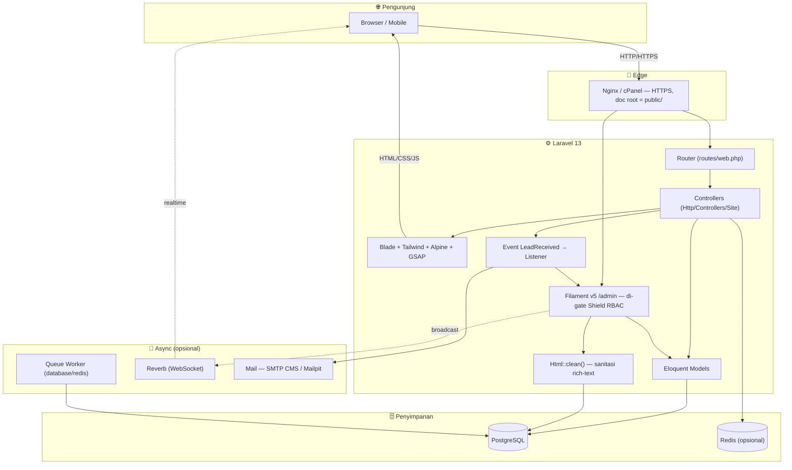
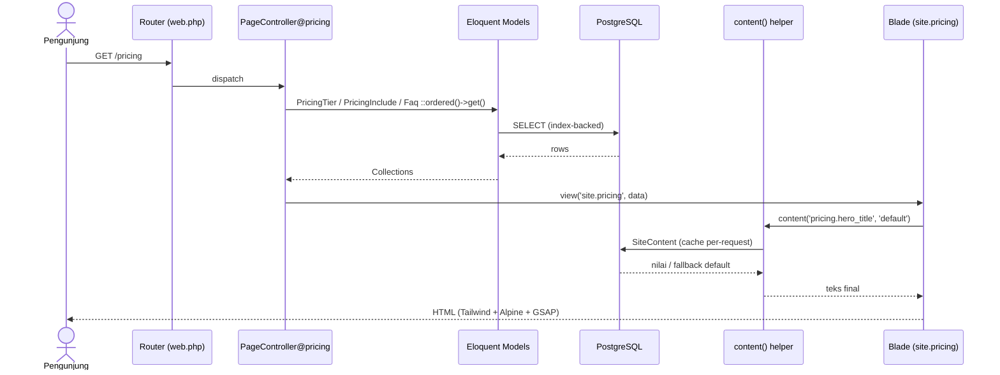
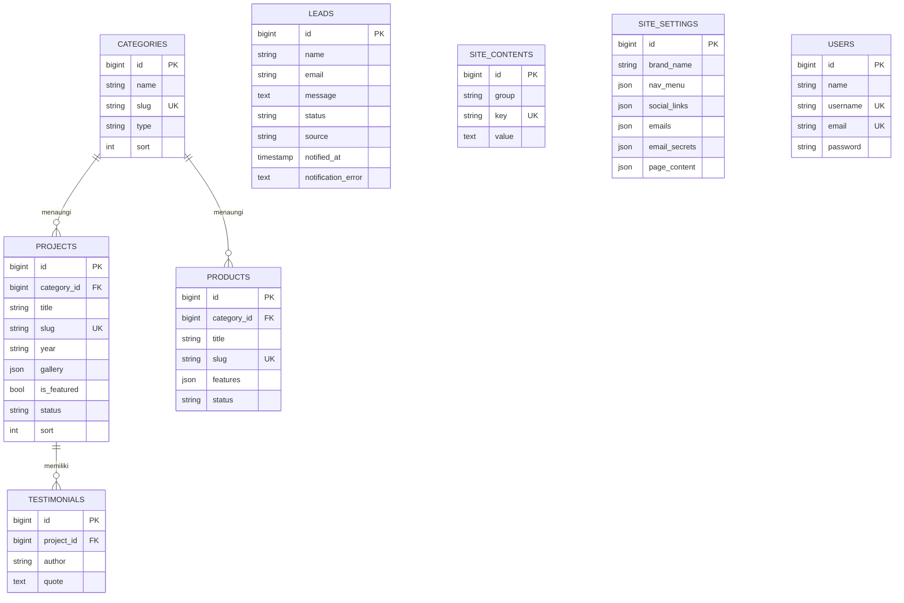
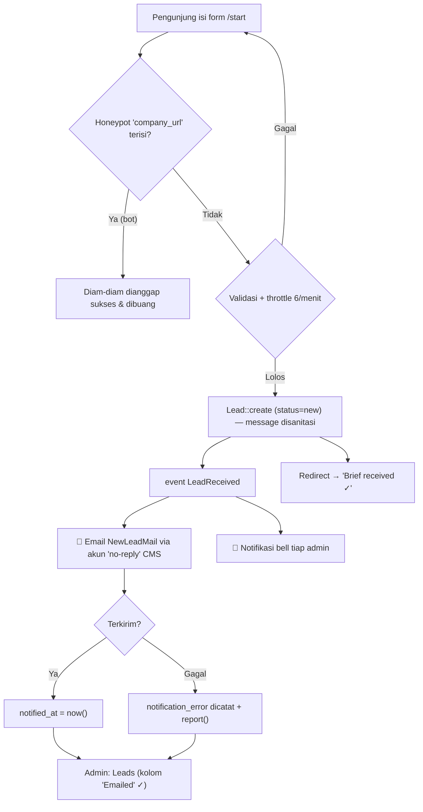
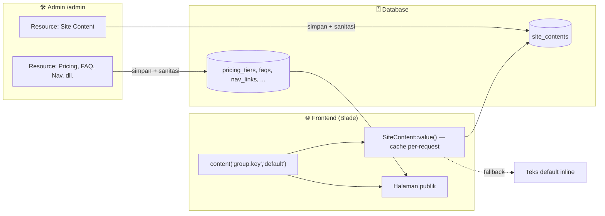
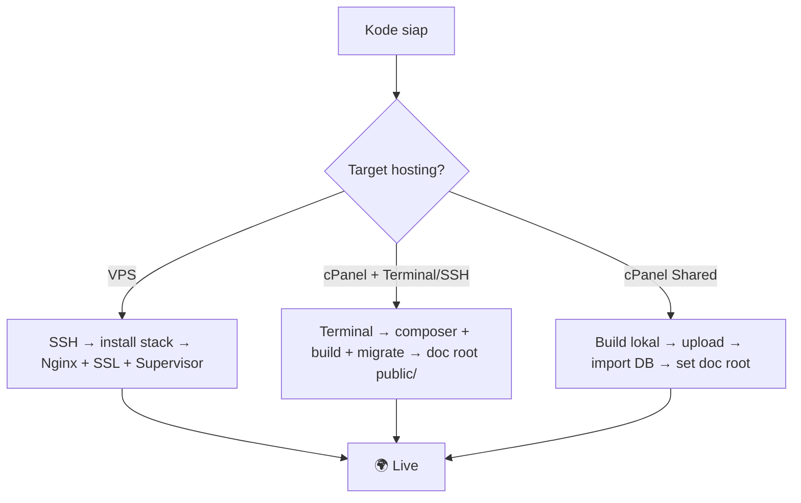

<div align="center">

# 🌳 Creative Trees Group

### Digital Product Studio & IT Ecosystem — Company Profile + Headless-style CMS

Website *company profile* profesional dengan estetika **monochrome • monospace • motion-driven**, ditenagai **Laravel 13 + Filament v5**, dengan **CMS penuh** sehingga *seluruh* konten frontend dapat dikelola tanpa menyentuh kode.

<!-- Badges -->


</div>

---

## 📑 Daftar Isi

1. [Tentang Proyek](#-tentang-proyek)
2. [Fitur Utama](#-fitur-utama)
3. [Tech Stack](#-tech-stack)
4. [Arsitektur Sistem](#-arsitektur-sistem)
5. [Alur Request](#-alur-request)
6. [Skema Database (ERD)](#-skema-database-erd)
7. [Alur Lead / Kontak](#-alur-lead--kontak)
8. [Alur CMS (Editable Content)](#-alur-cms-editable-content)
9. [Keamanan & Akses Admin (RBAC)](#-keamanan--akses-admin-rbac)
10. [Struktur Folder](#-struktur-folder)
11. [Instalasi Lokal](#-instalasi-lokal)
12. [Konfigurasi `.env`](#-konfigurasi-env)
13. [Deployment ke Produksi](#-deployment-ke-produksi)
    - [A. cPanel + Terminal / SSH](#a--cpanel--terminal--ssh-panduan-lengkap) ⭐
    - [B. cPanel Shared (tanpa Terminal)](#b--cpanel-shared-tanpa-terminal)
    - [C. VPS (Ubuntu 22/24)](#c--vps-ubuntu-2224)
14. [Panduan CMS / Admin](#-panduan-cms--admin)
15. [Perintah Berguna](#-perintah-berguna)
16. [Testing](#-testing)
17. [Troubleshooting](#-troubleshooting)
18. [Kontribusi & Lisensi](#-kontribusi--lisensi)

---

## 🌟 Tentang Proyek

**Creative Trees Group** adalah platform *company profile* untuk studio produk digital & ekosistem IT. Ia menggabungkan tiga lapisan:

- **Frontend publik** yang elegan — hero animatif, katalog layanan, portofolio + case study, pricing, proses kerja, tim, produk, FAQ, dan form lead — semuanya *mobile-first* dengan gerak halus (GSAP + Lenis + Alpine + Swiper).
- **Panel admin (CMS)** berbasis **Filament v5** dengan **18 resource** dan **dashboard analitik** — *setiap* teks, kartu, harga, FAQ, menu navigasi, hingga copy hero **dapat diubah tanpa coding**.
- **Arsitektur *config-driven* & cPanel-safe** — default berjalan **tanpa Redis dan tanpa WebSocket** (session/cache/queue lewat database), sehingga mulus di shared hosting; Redis & real-time (Reverb) tinggal diaktifkan lewat `.env` saat tersedia.

> **Filosofi desain:** *monochrome* (hitam/putih), *monospace*, brutalis-minimal, gerak yang terasa premium namun menghormati `prefers-reduced-motion`.

---

## ✨ Fitur Utama

- 🎨 **Frontend dinamis** — Home, Services, Work (+ case study), Pricing (carousel + FAQ accordion), Process, Team, Products, About, Contact, Start (lead form), plus `sitemap.xml` & `robots.txt` dinamis dan endpoint gambar responsif on-the-fly (`/img/{path}?w=…` → WebP).
- 🛠️ **CMS 18 resource** — Services · Products · Projects · Team Members · Clients · Testimonials · Pricing Tiers · Pricing Includes · Process Phases · Principles · FAQ · Start Steps · Nav Links · Categories · Leads · Users · Site Settings · **Site Content** (semua copy statis lewat helper `content()`).
- 📊 **Dashboard analitik** — 7 widget (Studio Overview, Leads Over Time, Leads by Status/Source, Conversion Funnel, Top Services, Latest Leads) berbasis ApexCharts, di-*gate* per-widget oleh RBAC.
- 📨 **Lead pipeline lengkap** — validasi, honeypot, rate-limit, `event → email + notifikasi bell admin`, **plus pelacakan status kirim email** (`notified_at`/`notification_error`) yang tampil di admin sehingga lead tidak pernah hilang diam-diam saat SMTP bermasalah.
- ✉️ **Mailbox multi-akun berbasis CMS** — akun email per-peran (no-reply, sales, support, dll.) dikelola dari Site Settings; **hanya password** yang disimpan (terenkripsi) — bagian non-rahasia ada di DB.
- 🔒 **Keamanan berlapis** — RBAC Filament Shield (default-deny), sanitasi rich-text di sisi simpan **dan** render, security headers + CSP, honeypot + throttle, MFA opsional, OTP reset password non-enumerating.
- ⚡ **Motion system** — reveal blur-in, text-scramble, magnetic buttons, canvas char-field, custom cursor, count-up, carousel (Swiper), smooth-scroll (Lenis).
- 🐳 **Docker stack** untuk dev — nginx · postgres · redis · reverb · queue · vite · mailpit.

---

## 🧱 Tech Stack

| Lapisan | Teknologi |
|---|---|
| **Bahasa** | PHP **8.3+** (dev di 8.5) |
| **Framework** | Laravel **13** |
| **Admin / CMS** | Filament **5** (Livewire 3) + **Filament Shield** (RBAC) + **Filament ApexCharts** |
| **Frontend** | Blade · Tailwind CSS **4** · Alpine.js · GSAP + ScrollTrigger · Lenis · Swiper |
| **Database** | **PostgreSQL 16/17** |
| **Cache / Queue / Session** | *Config-driven* — **`database` secara default** (nol dependensi eksternal); **Redis 7** opsional |
| **Real-time (opsional)** | Laravel **Reverb** + Laravel Echo + pusher-js (dimatikan default: `BROADCAST_CONNECTION=log`) |
| **Build** | Vite **8** |
| **Dev infra** | Docker Compose (nginx · postgres · redis · reverb · queue · vite · mailpit) |
| **Tooling** | Pint (format) · PHPUnit · Pail (log tail) · Faker |

---

## 🏗️ Arsitektur Sistem


```mermaid
graph TB
    subgraph CLIENT["🌐 Pengunjung"]
        B["Browser / Mobile"]
    end
    subgraph EDGE["🚪 Edge"]
        NG["Nginx / cPanel — HTTPS, doc root = public/"]
    end
    subgraph APP["⚙️ Laravel 13"]
        RT["Router (routes/web.php)"]
        CTRL["Controllers (Http/Controllers/Site)"]
        VIEW["Blade + Tailwind + Alpine + GSAP"]
        FIL["Filament v5 /admin — di-gate Shield RBAC"]
        MODEL["Eloquent Models"]
        EVT["Event LeadReceived → Listener"]
        SAN["Html::clean() — sanitasi rich-text"]
    end
    subgraph DATA["🗄️ Penyimpanan"]
        PG[("PostgreSQL")]
        RD[("Redis (opsional)")]
    end
    subgraph ASYNC["🔁 Async (opsional)"]
        QUEUE["Queue Worker (database/redis)"]
        REVERB["Reverb (WebSocket)"]
        MAIL["Mail — SMTP CMS / Mailpit"]
    end

    B -->|HTTP/HTTPS| NG --> RT --> CTRL
    CTRL --> MODEL --> PG
    CTRL --> VIEW -->|HTML/CSS/JS| B
    NG --> FIL --> MODEL
    FIL --> SAN --> PG
    CTRL --> RD
    CTRL --> EVT --> MAIL
    EVT --> FIL
    QUEUE --> PG
    FIL -. broadcast .-> REVERB -. realtime .-> B
```

---

## 🔄 Alur Request

Contoh: pengunjung membuka halaman **Pricing**.


```mermaid
sequenceDiagram
    actor U as Pengunjung
    participant R as Router (web.php)
    participant C as PageController@pricing
    participant M as Eloquent Models
    participant DB as PostgreSQL
    participant H as content() helper
    participant V as Blade (site.pricing)

    U->>R: GET /pricing
    R->>C: dispatch
    C->>M: PricingTier / PricingInclude / Faq ::ordered()->get()
    M->>DB: SELECT (index-backed)
    DB-->>M: rows
    M-->>C: Collections
    C->>V: view('site.pricing', data)
    V->>H: content('pricing.hero_title', 'default')
    H->>DB: SiteContent (cache per-request)
    DB-->>H: nilai / fallback default
    H-->>V: teks final
    V-->>U: HTML (Tailwind + Alpine + GSAP)
```

---

## 🗃️ Skema Database (ERD)

> Relasi inti: **Category** menaungi **Project** & **Product**; **Project** memiliki banyak **Testimonial**. Sisanya adalah konten mandiri / singleton yang dikelola via CMS.


```mermaid
erDiagram
    CATEGORIES ||--o{ PROJECTS : "menaungi"
    CATEGORIES ||--o{ PRODUCTS : "menaungi"
    PROJECTS  ||--o{ TESTIMONIALS : "memiliki"

    CATEGORIES {
        bigint id PK
        string name
        string slug UK
        string type
        int    sort
    }
    PROJECTS {
        bigint id PK
        bigint category_id FK
        string title
        string slug UK
        string year
        json   gallery
        bool   is_featured
        string status
        int    sort
    }
    PRODUCTS {
        bigint id PK
        bigint category_id FK
        string title
        string slug UK
        json   features
        string status
    }
    TESTIMONIALS {
        bigint id PK
        bigint project_id FK
        string author
        text   quote
    }
    LEADS {
        bigint id PK
        string name
        string email
        text   message
        string status
        string source
        timestamp notified_at
        text   notification_error
    }
    SITE_CONTENTS {
        bigint id PK
        string group
        string key UK
        text   value
    }
    SITE_SETTINGS {
        bigint id PK
        string brand_name
        json   nav_menu
        json   social_links
        json   emails
        json   email_secrets
        json   page_content
    }
    USERS {
        bigint id PK
        string name
        string username UK
        string email UK
        string password
    }
```

**Model & relasi (Eloquent):**

| Model | Relasi | Catatan |
|---|---|---|
| `Category` | `hasMany(Project)`, `hasMany(Product)` | taksonomi (`type`: project/product) |
| `Project` | `belongsTo(Category)`, `hasMany(Testimonial)` | portofolio / case study |
| `Product` | `belongsTo(Category)` | katalog produk |
| `Testimonial` | `belongsTo(Project)` | quote klien |
| `Lead` | — | pipeline kontak (+ pelacakan notifikasi) |
| `Service`, `TeamMember`, `Client`, `PricingTier`, `PricingInclude`, `ProcessPhase`, `Principle`, `Faq`, `StartStep`, `NavLink` | — | konten mandiri (semua punya `sort`) |
| `SiteContent` | — | key/value copy statis (cache per-request) |
| `SiteSetting` | — | singleton (id=1); brand, nav, sosial, akun email, page_content |
| `User` | `roles()` (Shield) | login **username**; akses panel = punya role |

---

## 📨 Alur Lead / Kontak


```mermaid
flowchart TD
    A["Pengunjung isi form /start"] --> B{"Honeypot 'company_url' terisi?"}
    B -- "Ya (bot)" --> Z["Diam-diam dianggap sukses & dibuang"]
    B -- "Tidak" --> C{"Validasi + throttle 6/menit"}
    C -- "Gagal" --> A
    C -- "Lolos" --> D["Lead::create (status=new) — message disanitasi"]
    D --> E["event LeadReceived"]
    E --> F["📧 Email NewLeadMail via akun 'no-reply' CMS"]
    E --> G["🔔 Notifikasi bell tiap admin"]
    F --> N{"Terkirim?"}
    N -- "Ya" --> OK["notified_at = now()"]
    N -- "Gagal" --> ERR["notification_error dicatat + report()"]
    D --> H["Redirect → 'Brief received ✓'"]
    OK --> I["Admin: Leads (kolom 'Emailed' ✓)"]
    ERR --> I
```

> **Ketahanan:** pengiriman email berjalan dengan **timeout SMTP 10 detik** dan dibungkus penanganan error, sehingga host SMTP yang tak terjangkau **tidak** menggantung request publik, dan kegagalan **terlihat** di admin (bukan sukses palsu).

---

## 🧩 Alur CMS (Editable Content)

Semua copy statis memakai helper global `content('group.key', 'default')` — mengambil nilai dari DB, *fallback* ke teks default bila kosong. Jadi halaman **tak pernah kosong** meski belum diisi. Nilai rich-text dirender lewat `rich_html()` yang menjalankan sanitizer sebagai pertahanan berlapis.


```mermaid
flowchart LR
    subgraph ADMIN["🛠️ Admin /admin"]
        A1["Resource: Site Content"]
        A2["Resource: Pricing, FAQ, Nav, dll."]
    end
    subgraph DBX["🗄️ Database"]
        T1[("site_contents")]
        T2[("pricing_tiers, faqs, nav_links, ...")]
    end
    subgraph FRONT["🌐 Frontend (Blade)"]
        H["content('group.key','default')"]
        L["SiteContent::value() — cache per-request"]
        P["Halaman publik"]
    end

    A1 -->|simpan + sanitasi| T1
    A2 -->|simpan + sanitasi| T2
    H --> L --> T1
    L -. "fallback" .-> Dft["Teks default inline"]
    H --> P
    T2 --> P
```

---

## 🔐 Keamanan & Akses Admin (RBAC)

> ⚠️ **Penting — model akses telah berganti.** Panel **tidak** lagi dibatasi domain email. Akses kini murni **RBAC (Filament Shield)**.

- **Login pakai `username` + password** (bukan email).
- **Gate akses panel = `User::canAccessPanel()` → `roles()->exists()`** — *default-deny*: user tanpa role Shield tidak bisa masuk. Kolom `is_admin` bersifat legacy dan **bukan** gerbang akses.
- **Role `developer`** melewati semua permission (`Gate::before`) — super-admin.
- **Setiap resource, page, dan widget** dilindungi permission Shield (`View:*`, `Create:*`, …). Dashboard sendiri selalu bisa diakses; **isi** yang tampil ditentukan permission `View:<Widget>` per widget (tidak ada permission `View:Dashboard`).
- **MFA opsional** — aktifkan lewat `PANEL_MFA_REQUIRED=true` (setup TOTP tersedia di panel).
- **Pin domain admin** — `ADMIN_PANEL_DOMAIN` mengunci `/admin` ke satu host (mis. subdomain), sehingga 404 di domain utama.
- **Sanitasi rich-text** — semua konten kaya (RichEditor + pesan Lead) melewati `App\Support\Html::clean()` saat **disimpan** dan saat **dirender** (`{!! rich_html() !!}`): allowlist tag/atribut, ``/tabel/`text-align` aman, buang `script/iframe/on*`/`javascript:`, dan link `href` divalidasi skema.
- **Upload gambar dibatasi** PNG/JPG/WEBP (SVG diblokir — mencegah XSS via aset statis).
- **Header keamanan + CSP**, cookie `http_only`/`secure`/`same_site=lax`, session terenkripsi, honeypot + `throttle:6,1` pada form publik.
- **Reset password** memakai OTP acak, hashed, kedaluwarsa, sekali pakai, dengan rate-limit per akun & per IP, dan respons non-enumerating.

---

## 📁 Struktur Folder

```text
creative-trees/
├── app/
│   ├── Http/Controllers/Site/    # Controller publik (Home, Page, Work, Product, Team, Lead, Image, Sitemap)
│   ├── Http/Middleware/           # SecurityHeaders, dll.
│   ├── Models/                    # Eloquent models (+ Concerns/SanitizesRichHtml)
│   ├── Filament/
│   │   ├── Resources/             # 18 resource CMS (Schemas/Tables/Pages)
│   │   ├── Widgets/               # 7 widget dashboard (ApexCharts)
│   │   └── Auth/                  # Login (username), ForgotPassword (OTP)
│   ├── Policies/                  # Policy per model (dihasilkan Shield)
│   ├── Events/ · Listeners/       # LeadReceived → NotifyTeamOfLead
│   └── Support/                   # Html.php (sanitizer), MailAccounts.php, helpers.php (content/rich_html/safe_url)
├── resources/
│   ├── views/site/                # Blade halaman (home, services, pricing, work, …)
│   ├── views/components/{site,ui}/# header, footer, button, field, marquee, …
│   ├── css/app.css                # design tokens + komponen (Tailwind v4)
│   └── js/app.js                  # motion system (GSAP/Lenis/Swiper/Alpine)
├── database/
│   ├── migrations/                # skema tabel + indeks
│   └── seeders/                   # DatabaseSeeder + per-entity (idempotent)
├── routes/web.php                 # semua route publik + /admin
├── config/                        # filament-shield.php, database, mail_accounts.php, dll.
├── docker/ · docker-compose.yml   # stack pengembangan
├── Makefile                       # shortcut dev (make up/migrate/test/…)
├── public/                        # DOCUMENT ROOT (index.php, build/, favicon)
└── tests/                         # PHPUnit (86 test)
```

---

## 💻 Instalasi Lokal

### Prasyarat
- PHP **8.3+**, Composer 2, Node **20+** & npm
- **PostgreSQL** & (opsional) **Redis** — atau cukup **Docker** (disarankan)

### Opsi 1 — Docker (disarankan) 🐳

```bash
git clone https://github.com/Creative-Trees/<repo>.git
cd <repo>
cp .env.example .env

# nyalakan seluruh stack (postgres :5433, redis, vite, mailpit, dll.)
make up            # setara: docker compose up -d

# siapkan aplikasi di dalam container
make install       # composer install + npm install
make key           # php artisan key:generate
make migrate       # atau: make fresh (migrate:fresh --seed)
make assets        # npm run build
```

Akses: **http://localhost:8000** • Admin: **/admin** • Email dev (Mailpit): **http://localhost:8025**

> ⚠️ **Catatan lokal:** Postgres Docker dipetakan ke **host port `5433`** (menghindari bentrok dengan Postgres native di 5432). Lihat `.env` (`DB_PORT=5433`).

### Opsi 2 — Manual (tanpa Docker)

```bash
git clone https://github.com/Creative-Trees/<repo>.git && cd <repo>
composer install
cp .env.example .env && php artisan key:generate

# sesuaikan DB_* di .env (DB_PORT=5432 untuk Postgres native), lalu:
php artisan migrate --seed
npm install && npm run build       # atau: composer dev (server+queue+logs+vite sekaligus)
php artisan serve                  # http://localhost:8000
```

> 💡 `composer dev` menjalankan **server + queue listener + Pail (log) + Vite** secara paralel — praktis untuk pengembangan.

---

## ⚙️ Konfigurasi `.env`

| Variabel | Contoh | Keterangan |
|---|---|---|
| `APP_ENV` | `production` | `local` saat dev |
| `APP_DEBUG` | `false` | **wajib false** di produksi |
| `APP_KEY` | `base64:…` | `php artisan key:generate` |
| `APP_URL` | `https://domain-anda.com` | URL kanonik (asset, redirect) |
| `DB_CONNECTION` | `pgsql` | PostgreSQL |
| `DB_HOST` / `DB_PORT` | `127.0.0.1` / `5432` | Docker lokal: `5433` |
| `DB_DATABASE` / `DB_USERNAME` / `DB_PASSWORD` | … | kredensial DB |
| `SESSION_DRIVER` | `database` | `redis` bila Redis tersedia |
| `CACHE_STORE` | `database` | `redis` bila tersedia |
| `QUEUE_CONNECTION` | `database` | `redis` bila tersedia |
| `BROADCAST_CONNECTION` | `log` | `reverb` untuk real-time |
| `VITE_ENABLE_REALTIME` | `false` | `true` untuk aktifkan Echo di frontend |
| `FILESYSTEM_DISK` | `public` | disk upload (butuh `storage:link`) |
| `PANEL_MFA_REQUIRED` | `false` | `true` → wajib TOTP untuk admin |
| `ADMIN_PANEL_DOMAIN` | *(kosong)* | pin `/admin` ke satu host; kosong = tanpa batas |
| `ADMIN_SEED_EMAIL` / `ADMIN_SEED_PASSWORD` | … | seeding admin awal (hanya jika password diisi) |
| `MAIL_MAILER` | `smtp` | mailer default |
| `MAIL_FROM_ADDRESS` | `no-reply@domain` | pastikan SPF/DKIM |
| `MAIL_NO_REPLY_PASSWORD` | … | password akun email per-peran (hanya password di `.env`) |

> **Filosofi *config-driven*:** default `database` untuk session/cache/queue + `log` untuk broadcast membuat aplikasi **jalan penuh tanpa Redis/WebSocket** — ideal untuk shared hosting. Aktifkan Redis/Reverb hanya saat lingkungan mendukung.

---

## 🚀 Deployment ke Produksi


```mermaid
flowchart TD
    S["Kode siap"] --> C{"Target hosting?"}
    C -->|cPanel + Terminal/SSH| V2["Terminal → composer + build + migrate → doc root public/"]
    C -->|cPanel Shared| V3["Build lokal → upload → import DB → set doc root"]
    C -->|VPS| V1["SSH → install stack → Nginx + SSL + Supervisor"]
    V1 --> DONE["🌍 Live"]
    V2 --> DONE
    V3 --> DONE
```

> **Wajib untuk SEMUA target:** `APP_ENV=production`, `APP_DEBUG=false`, `APP_URL=https://domain-anda`, DB **PostgreSQL**, `APP_KEY` terisi, jalankan `storage:link`, dan **document root = `public/`**. Build aset (`npm run build`) **sebelum** deploy bila hosting tak punya Node.

---

### A. ⭐ cPanel + Terminal / SSH (panduan lengkap)

> Ini jalur **paling profesional & paling mirip VPS**. cPanel modern menyediakan **Terminal** (menu *Advanced → Terminal*) atau akses **SSH**. Ikuti langkah berurutan berikut.

#### Prasyarat di cPanel
- **Terminal** aktif (atau SSH via *SSH Access*).
- **PHP 8.3+** tersedia (*MultiPHP Manager* / *Select PHP Version*).
- **PostgreSQL** tersedia (*PostgreSQL Databases*).
- **Composer** (umumnya sudah ada); **Node.js** opsional (*Setup Node.js App*).

#### Langkah 1 — Masuk Terminal & pilih PHP yang benar
Di cPanel, seringkali `php` default menunjuk versi lama. Gunakan biner **ea-php83** secara eksplisit:

```bash
# cek versi & lokasi
php -v
which php
# biner PHP 8.3 khas cPanel/CloudLinux:
/opt/cpanel/ea-php83/root/usr/bin/php -v

# (opsional) buat alias agar sesi ini pakai PHP 8.3
alias php='/opt/cpanel/ea-php83/root/usr/bin/php'
```

Aktifkan **ekstensi** ini via *Select PHP Version → Extensions*: `pdo_pgsql`, `pgsql`, `mbstring`, `openssl`, `tokenizer`, `ctype`, `json`, `bcmath`, `fileinfo`, `curl`, `gd`, `zip`, `xml`, `dom`.

#### Langkah 2 — Buat database PostgreSQL
Lewat UI **cPanel → PostgreSQL Databases** (nama akan diberi prefix akun, mis. `cpuser_`):
1. *Create Database* → `cpuser_creative`.
2. *Create User* → `cpuser_ctg` + password kuat.
3. *Add User To Database* → **All Privileges**.

Catat: **host = `localhost`**, **port = `5432`**.

#### Langkah 3 — Ambil kode (di luar `public_html`)
Simpan aplikasi di folder terpisah, mis. `~/creative-trees`, **bukan** di dalam `public_html`.

```bash
cd ~
git clone https://github.com/Creative-Trees/<repo>.git creative-trees
cd creative-trees
```

> Tanpa Git? Upload ZIP lewat **File Manager** ke `~/creative-trees` lalu *Extract*.

#### Langkah 4 — Install dependency PHP
```bash
# jika 'composer' tersedia:
composer install --no-dev --optimize-autoloader

# jika composer memakai PHP lama, paksa PHP 8.3:
/opt/cpanel/ea-php83/root/usr/bin/php $(which composer) install --no-dev --optimize-autoloader
```

#### Langkah 5 — Bangun aset frontend
```bash
# Bila Node tersedia (nvm / Setup Node.js App):
npm ci && npm run build
```
> **Bila cPanel TIDAK punya Node:** jalankan `npm run build` **di komputer lokal**, lalu upload folder hasil `public/build/` ke `~/creative-trees/public/build/`. Aset Vite bersifat statis — tak butuh Node di server.

#### Langkah 6 — Konfigurasi `.env`
```bash
cp .env.example .env
php artisan key:generate
nano .env   # edit nilai produksi
```
Nilai minimum untuk shared hosting (tanpa Redis):
```env
APP_ENV=production
APP_DEBUG=false
APP_URL=https://domain-anda.com
APP_KEY=base64:...              # sudah diisi key:generate

DB_CONNECTION=pgsql
DB_HOST=localhost
DB_PORT=5432
DB_DATABASE=cpuser_creative
DB_USERNAME=cpuser_ctg
DB_PASSWORD=********

SESSION_DRIVER=database
CACHE_STORE=database
QUEUE_CONNECTION=database
BROADCAST_CONNECTION=log        # real-time nonaktif (aman shared hosting)
FILESYSTEM_DISK=public

MAIL_MAILER=smtp
MAIL_HOST=mail.domain-anda.com
MAIL_PORT=465
MAIL_USERNAME=no-reply@domain-anda.com
MAIL_PASSWORD=********
MAIL_FROM_ADDRESS=no-reply@domain-anda.com

# Opsional keamanan admin:
PANEL_MFA_REQUIRED=false
ADMIN_PANEL_DOMAIN=            # mis. admin.domain-anda.com (lihat Langkah 9)
```

#### Langkah 7 — Migrasi, seeder, storage link, cache
```bash
php artisan migrate --force
php artisan db:seed --force        # opsional: data awal (idempotent)
php artisan storage:link           # symlink public/storage → storage/app/public
php artisan config:cache
php artisan route:cache
php artisan view:cache
php artisan filament:optimize      # cache komponen Filament (produksi)
```

#### Langkah 8 — Izin folder
```bash
chmod -R 775 storage bootstrap/cache
# (opsional, umumnya sudah benar di cPanel karena satu user)
find storage bootstrap/cache -type d -exec chmod 775 {} \;
```

#### Langkah 9 — Arahkan Document Root ke `public/`
Aplikasi **harus** disajikan dari `public/`. Pilih salah satu:

- **Cara A (disarankan) — Subdomain/Addon domain:** buat domain/subdomain di cPanel dan set **Document Root**-nya ke `/home/cpuser/creative-trees/public`.
- **Cara B — Symlink `public_html`:** kosongkan `public_html`, lalu:
  ```bash
  rm -rf ~/public_html
  ln -s ~/creative-trees/public ~/public_html
  ```
- **Cara C — Tanpa symlink:** pindahkan **isi** `public/` ke `public_html/`, lalu edit `public_html/index.php` agar dua baris `require` menunjuk balik ke aplikasi:
  ```php
  require __DIR__.'/../creative-trees/vendor/autoload.php';
  $app = require_once __DIR__.'/../creative-trees/bootstrap/app.php';
  ```

> **Mengunci /admin ke satu host:** untuk *super-professional*, buat subdomain `admin.domain-anda.com` yang *share document root* dengan domain utama, lalu set `ADMIN_PANEL_DOMAIN=admin.domain-anda.com` di `.env`. Panel akan 404 di domain publik.

#### Langkah 10 — HTTPS
Aktifkan **AutoSSL** (cPanel → *SSL/TLS Status → Run AutoSSL*) atau pasang sertifikat Let's Encrypt untuk domain & subdomain admin.

#### Langkah 11 — Scheduler & Queue (Cron)
Karena `QUEUE_CONNECTION=database`, jalankan lewat **Cron Jobs** (cPanel → *Cron Jobs*). Gunakan biner PHP 8.3 absolut:

```bash
# Scheduler Laravel — tiap menit
* * * * * /opt/cpanel/ea-php83/root/usr/bin/php /home/cpuser/creative-trees/artisan schedule:run >> /dev/null 2>&1

# Queue worker — proses antrian lalu berhenti (aman untuk shared hosting), tiap menit
* * * * * /opt/cpanel/ea-php83/root/usr/bin/php /home/cpuser/creative-trees/artisan queue:work --stop-when-empty --tries=3 --max-time=55 >> /dev/null 2>&1
```

> Email lead dikirim **sinkron** saat submit (timeout 10 dtk), jadi queue **tidak wajib** untuk notifikasi lead — cron di atas hanya untuk job terjadwal lain.

#### Langkah 12 — Buat admin & role (RBAC)
```bash
# hasilkan permission Shield untuk semua resource/page/widget
php artisan shield:generate --all --panel=admin

# buat/promosikan user super-admin 'developer' (interaktif):
php artisan shield:super-admin
```
Lalu login di `https://domain-anda.com/admin` memakai **username** + password. Beri role yang sesuai ke staf lain lewat menu **Roles**.

#### 🔄 Update rilis berikutnya
```bash
cd ~/creative-trees
php artisan down                     # maintenance mode
git pull
composer install --no-dev --optimize-autoloader
npm ci && npm run build              # atau upload public/build dari lokal
php artisan migrate --force
php artisan optimize                 # config+route+view cache
php artisan filament:optimize
php artisan up
```

---

### B. 📦 cPanel Shared (tanpa Terminal)

> Bila cPanel Anda **tidak** punya Terminal/SSH. Kuncinya: **siapkan semua di lokal**, lalu upload.

1. **Build di lokal:** `composer install --no-dev --optimize-autoloader && npm ci && npm run build`.
2. **Buat DB PostgreSQL** di cPanel (lihat Langkah 2 di atas).
3. **Siapkan data:** arahkan `.env` **lokal** ke DB cPanel (host = server cPanel) → `php artisan migrate --seed`; **atau** `pg_dump` lokal → impor via **phpPgAdmin**.
4. **Upload:** ZIP seluruh folder (**sertakan** `vendor/` dan `public/build/`) → File Manager → extract ke `~/creative-trees`.
5. **Document Root → `public/`** (lihat Langkah 9, Cara A/B/C).
6. **Edit `.env`** via File Manager (nilai produksi, `CACHE_STORE=file`/`SESSION_DRIVER=file` bila diinginkan; salin `APP_KEY` dari lokal via `php artisan key:generate --show`).
7. **`storage:link`** tak bisa via terminal → buat symlink manual di File Manager, atau set `FILESYSTEM_DISK` dan arahkan folder sesuai.

---

### C. 🖥️ VPS (Ubuntu 22/24)

<details>
<summary><b>Klik untuk panduan VPS lengkap (Nginx + PHP-FPM + Supervisor + SSL)</b></summary>

**1) Dependensi**
```bash
sudo apt update && sudo apt install -y nginx postgresql redis-server unzip git \
  php8.3-fpm php8.3-cli php8.3-pgsql php8.3-redis php8.3-mbstring php8.3-xml \
  php8.3-curl php8.3-zip php8.3-bcmath php8.3-gd
curl -sS https://getcomposer.org/installer | php && sudo mv composer.phar /usr/local/bin/composer
curl -fsSL https://deb.nodesource.com/setup_20.x | sudo -E bash - && sudo apt install -y nodejs
```

**2) Database**
```bash
sudo -u postgres psql -c "CREATE DATABASE creative_trees;"
sudo -u postgres psql -c "CREATE USER ctg WITH ENCRYPTED PASSWORD 'GANTI_PASSWORD';"
sudo -u postgres psql -c "GRANT ALL PRIVILEGES ON DATABASE creative_trees TO ctg;"
```

**3) Deploy**
```bash
cd /var/www && sudo git clone https://github.com/Creative-Trees/<repo>.git creative-trees
cd creative-trees
composer install --no-dev --optimize-autoloader
npm ci && npm run build
cp .env.example .env && php artisan key:generate
# edit .env → production, DB_*, REDIS_* (boleh redis di VPS)
php artisan migrate --force --seed
php artisan storage:link
php artisan optimize && php artisan filament:optimize
sudo chown -R www-data:www-data storage bootstrap/cache
sudo chmod -R 775 storage bootstrap/cache
```

**4) Nginx** (`/etc/nginx/sites-available/creative-trees`)
```nginx
server {
    listen 80;
    server_name domain-anda.com;
    root /var/www/creative-trees/public;   # ⬅️ doc root = public/
    index index.php;
    location / { try_files $uri $uri/ /index.php?$query_string; }
    location ~ \.php$ {
        fastcgi_pass unix:/run/php/php8.3-fpm.sock;
        fastcgi_param SCRIPT_FILENAME $realpath_root$fastcgi_script_name;
        include fastcgi_params;
    }
    location ~ /\.(?!well-known).* { deny all; }
}
```
```bash
sudo ln -s /etc/nginx/sites-available/creative-trees /etc/nginx/sites-enabled/
sudo nginx -t && sudo systemctl reload nginx
sudo apt install -y certbot python3-certbot-nginx && sudo certbot --nginx -d domain-anda.com
```

**5) Supervisor (queue + real-time)** (`/etc/supervisor/conf.d/ctg.conf`)
```ini
[program:ctg-queue]
command=php /var/www/creative-trees/artisan queue:work --tries=3 --timeout=90
autostart=true
autorestart=true
user=www-data
numprocs=1

[program:ctg-reverb]
command=php /var/www/creative-trees/artisan reverb:start --host=0.0.0.0 --port=8080
autostart=true
autorestart=true
user=www-data
```
```bash
sudo supervisorctl reread && sudo supervisorctl update && sudo supervisorctl start all
```
Aktifkan real-time: set `BROADCAST_CONNECTION=reverb` + `VITE_ENABLE_REALTIME=true`, isi kredensial `REVERB_*`, lalu `npm run build` ulang.

</details>

---

## 🛠️ Panduan CMS / Admin

- **URL:** `/admin` → login pakai **username** + password.
- **Akses = RBAC Shield** (default-deny). Beri role via menu **Roles**; role `developer` = super-admin.
- **Grup "Content"** memuat semua yang bisa di-CRUD: Services · Products · Projects · Team · Clients · Testimonials · Pricing Tiers/Includes · Process Phases · Principles · FAQ · Start Steps · Nav Links · Categories · Leads · Users · Site Settings · **Site Content**.
- **Site Settings** mengelola brand/logo, menu header, sosial, **akun email per-peran**, dan seluruh `page_content`.
- **Leads** menampilkan kolom **"Emailed"** (status notifikasi tim) + alasan gagal bila ada — sehingga lead tak pernah hilang diam-diam.
- Ubah nilai → **simpan** → halaman publik langsung berubah (cache di-flush otomatis).

---

## 🧰 Perintah Berguna

```bash
# Via Makefile (dev/Docker)
make help          # daftar semua target
make up / down     # start / stop stack Docker
make shell         # masuk container app
make migrate       # jalankan migrasi
make fresh         # migrate:fresh --seed
make test          # jalankan test suite
make pint          # format kode PHP
make assets        # build aset produksi
make optimize      # cache config/route/view

# Via artisan langsung
php artisan migrate --seed
php artisan storage:link
php artisan optimize / optimize:clear
php artisan shield:generate --all --panel=admin   # regen permission RBAC
php artisan shield:super-admin                     # buat super-admin
php artisan test
composer dev                                       # server+queue+logs+vite (dev)
```

> ⚠️ **Setelah menambah resource/page/widget baru**, jalankan `php artisan shield:generate --all --panel=admin` — `ShieldCoverageTest` akan gagal bila ada entitas yang belum di-*gate*.

---

## ✅ Testing

```bash
php artisan test          # atau: make test
```
**86 test** mencakup: render rute publik, render panel admin, cakupan RBAC Shield tiap widget/page/resource, sanitizer rich-text (termasuk regresi teks polos & allowlist img/tabel), dan health-check. *Suite hijau* sebelum setiap rilis.

---

## 🩺 Troubleshooting

| Gejala | Kemungkinan penyebab & solusi |
|---|---|
| **500 di produksi, layar putih** | `APP_KEY` kosong → `php artisan key:generate`; cek `storage/logs`; pastikan `chmod 775 storage bootstrap/cache`. |
| **Aset/CSS tidak muncul** | `public/build/` belum di-upload/di-build → `npm run build` atau upload manifest; jalankan `php artisan storage:link` untuk gambar. |
| **`could not find driver` (pgsql)** | Ekstensi `pdo_pgsql` belum aktif → aktifkan di *Select PHP Version*. |
| **Composer pakai PHP lama di cPanel** | Panggil eksplisit: `/opt/cpanel/ea-php83/root/usr/bin/php $(which composer) …`. |
| **404 di semua route kecuali home** | Document root belum menunjuk `public/` → perbaiki di *Domains* atau symlink. |
| **Gambar upload 404** | `storage:link` belum dibuat, atau `FILESYSTEM_DISK`/permission salah. |
| **Tidak bisa login admin** | User belum punya **role Shield** (`canAccessPanel` default-deny) → beri role via *Roles* atau `shield:super-admin`. |
| **Email lead tak terkirim** | Lihat kolom **"Emailed"** di Leads + `notification_error`; cek akun `no-reply` di Site Settings / SMTP `.env`. |
| **Perubahan konten tak muncul** | Cache config lama → `php artisan optimize:clear` lalu `php artisan optimize`. |

---

## 🤝 Kontribusi & Lisensi

**Kontribusi**
1. Buat branch fitur: `git checkout -b fitur/nama`.
2. Ikuti gaya kode (`./vendor/bin/pint`) & pastikan `php artisan test` hijau.
3. Setelah menambah entitas Filament: `php artisan shield:generate --all --panel=admin`.
4. Commit deskriptif → buka Pull Request.

**Lisensi**
© Creative Trees Group. Hak cipta dilindungi. Penggunaan internal organisasi — hubungi pemilik untuk lisensi.

<div align="center">

**Dibangun dengan ❤️ menggunakan Laravel 13 + Filament v5.**

</div>
